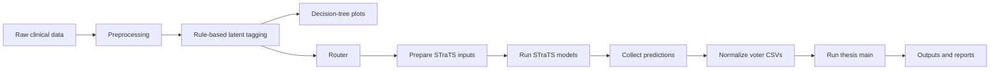

# CliniCause

CliniCause is a reproducible research pipeline for causal analysis of irregular clinical time-series data. It combines:

- a thesis-oriented preprocessing and latent-tagging workflow in [causal-irregular-time-series](causal-irregular-time-series)
- a sequence-model training and prediction workflow in [STraTS](STraTS)
- a unified router in [router.py](router.py) that connects both repositories into one end-to-end run

## What this project contains

- [router.py](router.py): orchestrates the full pipeline
- [SCRIPTS.md](SCRIPTS.md): minimal usage examples and flag reference
- [requirements-router.txt](requirements-router.txt): lightweight router-side dependencies
- [requirements-full.txt](requirements-full.txt): full stack dependencies for the thesis repository plus STraTS
- [causal-irregular-time-series](causal-irregular-time-series): thesis preprocessing, tagging, decision-tree plotting, and downstream causal analysis
- [STraTS](STraTS): model training, evaluation, and prediction export

## Requirements

Before running the pipeline, make sure you have:

- Python 3.9 or newer
- the two repositories present at the expected locations
- access to the required raw datasets on the machine where the run will execute

## Setup

Create and activate a Python environment, then install dependencies:

```bash
python -m venv .venv
source .venv/bin/activate
pip install -r requirements-router.txt
```

For a full end-to-end run that executes the thesis pipeline plus STraTS, install the full stack instead:

```bash
pip install -r requirements-full.txt
```

On Windows PowerShell, use:

```powershell
py -m venv .venv
.\.venv\Scripts\Activate.ps1
pip install -r requirements-router.txt
```

For a full run on Windows:

```powershell
pip install -r requirements-full.txt
```

## Architecture



## Quick start

### 1. Validate the setup

```bash
python router.py --dataset both --run-id demo_run --strats-repo-root ./STraTS --validate-only
```

### 2. Preview the full plan without executing it

```bash
python router.py --dataset both --run-id demo_run --strats-repo-root ./STraTS --stages all --dry-run
```

### 3. Run the full pipeline

```bash
python router.py \
  --dataset both \
  --run-id full_001 \
  --output-root runs \
  --thesis-repo-root ./causal-irregular-time-series \
  --strats-repo-root ./STraTS \
  --physionet-raw-data-path /path/to/physionet2012 \
  --mimic-raw-data-path /path/to/mimiciii \
  --stages all \
  --overwrite
```

## Notes

- The router is designed to be run on a machine that has the datasets available, such as a remote server.
- The router writes its outputs under the run directory created in the chosen output root.
- For the full set of supported flags and examples, see [SCRIPTS.md](SCRIPTS.md).
