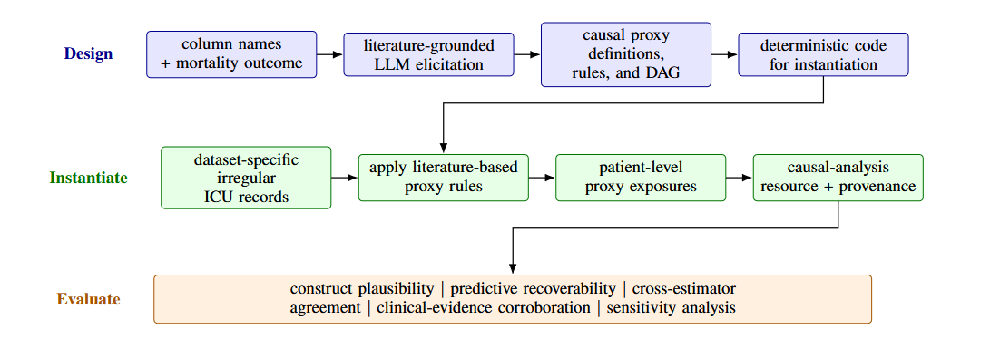
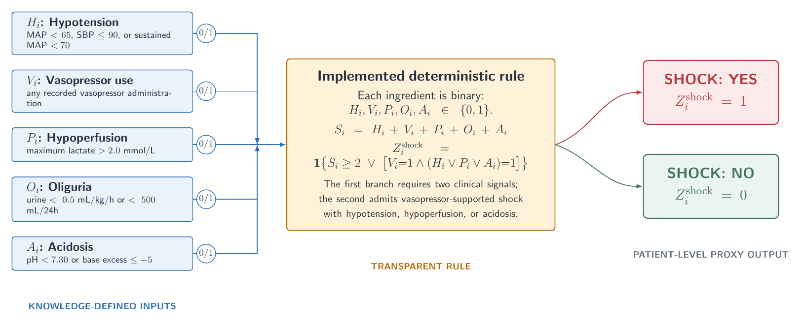

# CliniCause

CliniCause is a research pipeline for constructing and analyzing observational causal-analysis testbeds from irregular ICU time-series data. It links dataset-specific preprocessing and deterministic proxy-state construction with temporal-model prediction, aggregation, graph-guided causal analysis, and run-level provenance records.

## Pipeline



The pipeline has three connected stages:

- **Design:** schema and literature information inform proxy-state and graph proposals; project-selected definitions are encoded as deterministic source code.
- **Instantiate:** source-specific preprocessing constructs patient-level resources from MIMIC-III and PhysioNet/Computing in Cardiology Challenge 2012 records.
- **Evaluate:** temporal models predict rule-derived proxy labels, whose normalized and aggregated outputs feed graph-guided causal analyses and diagnostics.

The LLM-assisted design process uses schema information, not patient records, and is not invoked during pipeline execution or estimation.



The proxy states are operational research representations derived from source-recorded measurements and deterministic rules. They are not clinical diagnoses or causal ground truth.

## Repository layout

- [run_clinicause.sh](run_clinicause.sh): canonical launcher for the integrated pipeline
- [router.py](router.py): project-level orchestration
- [requirements.txt](requirements.txt): project-wide dependency entry point
- [src/causal-irregular-time-series](src/causal-irregular-time-series): preprocessing, proxy construction, graphs, and causal-analysis code
- [src/STraTS](src/STraTS): temporal-model training, evaluation, and prediction export
- [SCRIPTS.md](SCRIPTS.md): launcher variables and integrated script reference
- [docs/](docs): thesis and supporting project documentation

## Installation

Create and activate the Conda environment, then install the project dependencies from the repository root:

```bash
conda create -n clinicause python=3.10 -y
conda activate clinicause
python -m pip install --upgrade pip
python -m pip install -r requirements.txt
```

The root requirements file includes the dependencies of both component directories.

## Data access

CliniCause does not distribute MIMIC-III or PhysioNet Challenge 2012 records. Obtain each dataset directly from PhysioNet and comply with its current access, credentialing, data-use, and license requirements. Keep restricted records under the authorized user's control.

By default, the launcher reads raw datasets from:

```text
data/physionet2012
data/mimiciii
```

To use data stored elsewhere, set absolute paths before launching:

```bash
export PHYSIONET_RAW_DATA_PATH=/absolute/path/to/physionet2012
export MIMIC_RAW_DATA_PATH=/absolute/path/to/mimiciii
```

## Run CliniCause

Run commands from the repository root with the Conda environment activated.

### Construct reusable datasets

This preset runs preprocessing, deterministic tagging, temporal-model preparation and prediction, prediction collection and normalization, graph construction, and majority-vote aggregation. It stops before the later causal estimators.

```bash
STAGES=dataset-extraction bash run_clinicause.sh
```

### Run the complete pipeline

```bash
STAGES=all bash run_clinicause.sh
```

The default dataset selector is `both`. Set `DATASET=physionet` or `DATASET=mimic` to run one source. The launcher also accepts `OUTPUT_ROOT`, `RUN_ID`, `PHYSIONET_RAW_DATA_PATH`, `MIMIC_RAW_DATA_PATH`, `STRATS_MAX_CONCURRENT`, and `PYTHON_BIN`; see [SCRIPTS.md](SCRIPTS.md) for details.

Outputs are isolated under `runs/<run-id>/`, with separate `physionet/` and `mimic/` directories plus run metadata, resolved configurations, logs, manifests, artifact hashes, and stage receipts.

## Reproducibility scope

The current checkout provides a unified installation and execution interface for reconstructing derived resources from independently obtained source data. It does not redistribute source ICU records, establish clinical construct validity or causal identification, or by itself reproduce every archived thesis result exactly.
